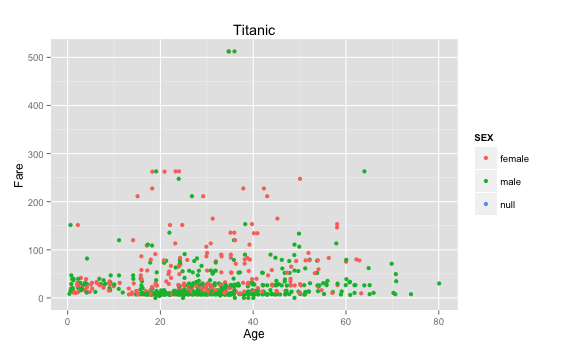
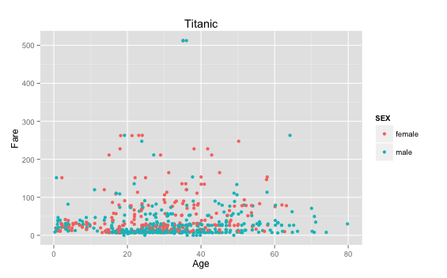
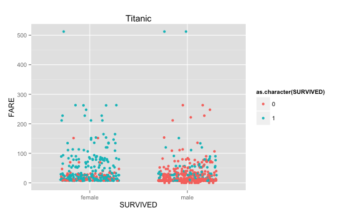
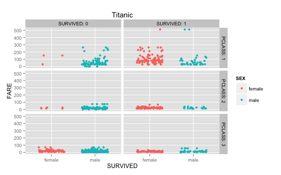
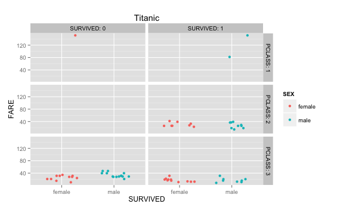
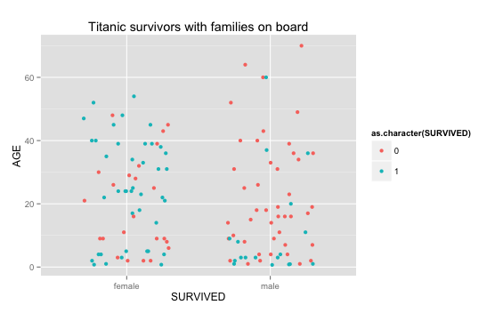

## Plot 1: Passenger distribution based on age and fare (including sex=null)
* We found that the vast majority of passengers are between 20 and 40 years of age and paid less than 100 Fare.



**Code:**
```{r, eval=FALSE}
require("jsonlite")
require("RCurl")

df <- data.frame(fromJSON(getURL(URLencode('129.152.144.84:5001/rest/native/?query="select * from titanic"'),httpheader=c(DB='jdbc:oracle:thin:@129.152.144.84:1521/PDBF15DV.usuniversi01134.oraclecloud.internal', USER='cs329e_jso464', PASS='orcl_jso464', MODE='native_mode', MODEL='model', returnDimensions = 'False', returnFor = 'JSON'), verbose = TRUE), ))
df
summary(df)
head(df)

require(extrafont)
ggplot() + 
  coord_cartesian() + 
  scale_x_continuous() +
  scale_y_continuous() +
  labs(title='Titanic') +
  labs(x="Age", y=paste("Fare")) +
  layer(data=df, 
        mapping=aes(x=as.numeric(as.character(AGE)), y=as.numeric(as.character(FARE)), color=SEX), 
        stat="identity", 
        stat_params=list(), 
        geom="point",
        geom_params=list(), 
        position=position_jitter(width=0.3, height=0)
  )
```

## Plot 2: Passenger distribution based on age and fare (excluding sex=null)
* Same findings as Plot 1, excluding the passengers with sex=null.



**Code:**
```{r, eval=FALSE}
df <- data.frame(fromJSON(getURL(URLencode('129.152.144.84:5001/rest/native/?query="select * from titanic where sex is not null"'),httpheader=c(DB='jdbc:oracle:thin:@129.152.144.84:1521/PDBF15DV.usuniversi01134.oraclecloud.internal', USER='cs329e_jso464', PASS='orcl_jso464', MODE='native_mode', MODEL='model', returnDimensions = 'False', returnFor = 'JSON'), verbose = TRUE), ))

ggplot() + 
  coord_cartesian() + 
  scale_x_continuous() +
  scale_y_continuous() +
  labs(title='Titanic') +
  labs(x="Age", y=paste("Fare")) +
  layer(data=df, 
        mapping=aes(x=as.numeric(as.character(AGE)), y=as.numeric(as.character(FARE)), color=SEX), 
        stat="identity", 
        stat_params=list(), 
        geom="point",
        geom_params=list(), 
        position=position_jitter(width=0.3, height=0)
  )
```

## Plot 3: Plot based on sex and fare, survived vs did not survive
* We found that there were significantly more female survivors than male survivors, regardless of fare.



**Code:**
```{r, eval=FALSE}
ggplot() + 
  coord_cartesian() + 
  scale_x_discrete() +
  scale_y_continuous() +
  labs(title='Titanic') +
  labs(x="SURVIVED", y=paste("FARE")) +
  layer(data=df, 
        mapping=aes(x=SEX, y=as.numeric(as.character(FARE)), color=as.character(SURVIVED)), 
        stat="identity", 
        stat_params=list(), 
        geom="point",
        geom_params=list(), 
        position=position_jitter(width=0.3, height=0)
  )
```

## Plot 4: Grid plot of survivors, based on sex, passenger class, and fare
* We found that more survivors were in passenger class 1 than in the other two classes.



**Code:**
```{r, eval=FALSE}
ggplot() + 
  coord_cartesian() + 
  scale_x_discrete() +
  scale_y_continuous() +
  facet_grid(PCLASS~SURVIVED, labeller=label_both) +
  labs(title='Titanic') +
  labs(x="SURVIVED", y=paste("FARE")) +
  layer(data=df, 
        mapping=aes(x=SEX, y=as.numeric(as.character(FARE)), color=SEX), 
        stat="identity", 
        stat_params=list(), 
        geom="point",
        geom_params=list(), 
        position=position_jitter(width=0.3, height=0)
  )
```

## Plot 5: Grid plot of survivors younger than 11, based on sex, passenger class, and fare
* There were very few passengers under the age of 11 in passenger class 1, all passengers under the age of 11 in class 2 survived, and about half of the passengers under the age of 11 in class 3 survived. 



**Code:**
```{r, eval=FALSE}
df <- data.frame(fromJSON(getURL(URLencode('129.152.144.84:5001/rest/native/?query="select * from titanic where sex is not null and age <= 10"'),httpheader=c(DB='jdbc:oracle:thin:@129.152.144.84:1521/PDBF15DV.usuniversi01134.oraclecloud.internal', USER='cs329e_jso464', PASS='orcl_jso464', MODE='native_mode', MODEL='model', returnDimensions = 'False', returnFor = 'JSON'), verbose = TRUE), ))

ggplot() + 
  coord_cartesian() + 
  scale_x_discrete() +
  scale_y_continuous() +
  facet_grid(PCLASS~SURVIVED, labeller=label_both) +
  labs(title='Titanic') +
  labs(x="SURVIVED", y=paste("FARE")) +
  layer(data=df, 
        mapping=aes(x=SEX, y=as.numeric(as.character(FARE)), color=SEX), 
        stat="identity", 
        stat_params=list(), 
        geom="point",
        geom_params=list(), 
        position=position_jitter(width=0.3, height=0)
  )
```

## Plot 6: Titanic survivors with families on board, based on sex and age
* The majority of males with families on board did not survive, while most females with families on board survived. This was regardless of age. 



**Code:**
```{r, eval=FALSE}
df <- data.frame(fromJSON(getURL(URLencode('129.152.144.84:5001/rest/native/?query="select * from titanic where SIBSP <> 0 and PARCH <> 0"'),httpheader=c(DB='jdbc:oracle:thin:@129.152.144.84:1521/PDBF15DV.usuniversi01134.oraclecloud.internal', USER='cs329e_jso464', PASS='orcl_jso464', MODE='native_mode', MODEL='model', returnDimensions = 'False', returnFor = 'JSON'), verbose = TRUE), ))

ggplot() + 
  coord_cartesian() + 
  scale_x_discrete() +
  scale_y_continuous() +
  labs(title='Titanic survivors with families on board') +
  labs(x="SURVIVED", y=paste("AGE")) +
  layer(data=df, 
        mapping=aes(x=SEX, y=as.numeric(as.character(AGE)), color=as.character(SURVIVED)), 
        stat="identity", 
        stat_params=list(), 
        geom="point",
        geom_params=list(), 
        #position=position_identity()
        position=position_jitter(width=0.3, height=0)
  )
```

## Head and Summary

```{r, echo=FALSE}
require("jsonlite")
require("RCurl")

df <- data.frame(fromJSON(getURL(URLencode('129.152.144.84:5001/rest/native/?query="select * from titanic"'),httpheader=c(DB='jdbc:oracle:thin:@129.152.144.84:1521/PDBF15DV.usuniversi01134.oraclecloud.internal', USER='cs329e_jso464', PASS='orcl_jso464', MODE='native_mode', MODEL='model', returnDimensions = 'False', returnFor = 'JSON'), verbose = TRUE), ))

summary(df)
head(df)
```
